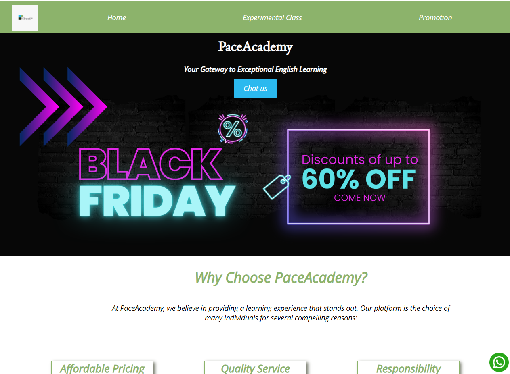

  <h1>PaceAcademy</h1>
  
<em>Your Gateway to Exceptional English Learning</em>

  

    
    
    
    
    
  

  

    <a href="https://juliodesouza121.github.io/PaceAcademyWebSite/" style="text-decoration:none;padding:10px 18px;border-radius:6px;border:1px solid #0b6;display:inline-block;margin:4px;">Live Demo</a>
    <a href="#features" style="text-decoration:none;padding:10px 18px;border-radius:6px;border:1px solid #09f;display:inline-block;margin:4px;">Features</a>
    <a href="#roadmap" style="text-decoration:none;padding:10px 18px;border-radius:6px;border:1px solid #f90;display:inline-block;margin:4px;">Roadmap</a>
  

<h2 id="about">About this project</h2>

  <strong>PaceAcademy</strong> is a prototype website for an English school focused on clarity, conversion, and easy navigation.  
  It is designed as a demo project to showcase responsive design, clear CTAs, and institutional content.

<h3>Quick Demo</h3>

Here’s how the website looks in action:

  

<h2 id="features">Features</h2>
<ul>
  <li>Clear presentation of the proposal (Home, Experimental Class, Promotion).</li>
  <li>Visible Call To Actions (Join, Contact, Chat).</li>
  <li>Simple and consistent design — a good base for responsive development.</li>
  <li>Deployed via GitHub Pages.</li>
  <li>Room for additional sections like testimonials, pricing plans, and FAQ.</li>
</ul>

<h2 id="installation">Deployment / Installation</h2>
<ol>
  <li>Clone the repository: <code>git clone https://github.com/juliodesouza121/PaceAcademyWebSite.git</code></li>
  <li>Open <code>index.html</code> directly, or deploy using GitHub Pages.</li>
  <li>To update images, place them inside <code>/assets/</code> and update the paths in the README.</li>
</ol>

<h2 id="usage">Usage</h2>

  Access the live demo at <a href="https://juliodesouza121.github.io/PaceAcademyWebSite/">https://juliodesouza121.github.io/PaceAcademyWebSite/</a>.  

<h2 id="tech">Tech Stack</h2>

  
  
  

<h2 id="contributing">Contributing</h2>

  Contributions are welcome!  
  Open an <strong>issue</strong> or a <strong>pull request</strong> with improvements — e.g. image optimization, layout redesign, or translation (PT/EN).

<h2 id="contact">Contact</h2>

  Júlio César — <a href="https://www.linkedin.com/in/júlio-césar-de-souza-0a8798233/">LinkedIn</a> •
  <a href="mailto:julioskn@hotmail.com">julioskn@hotmail.com</a>

